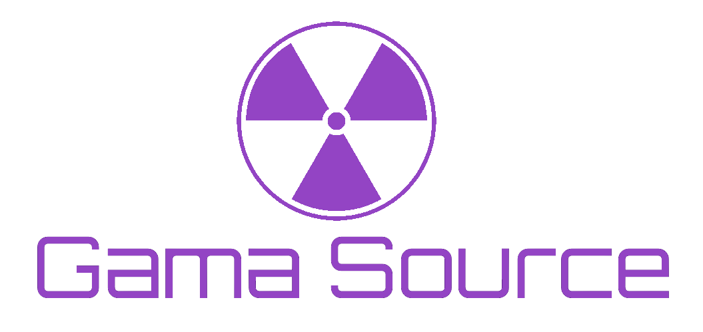

# GamaSource - Biblioteca para Desenvolvimento de Jogos Web 2D

A biblioteca GamaSource é uma biblioteca para simplificar o desenvolvimento de jogos web 2D, permitindo que você crie jogos incríveis usando apenas as APIs nativas do HTML5. Esta biblioteca foi desenvolvida para tornar o processo de criação de jogos web mais fácil, proporcionando funcionalidades úteis e uma abstração conveniente das APIs do HTML5.

## Recursos Principais (ainda em implementação)

- **Controle de sprites**: Gerencie facilmente personagens, objetos e elementos do jogo usando sprites, incluindo animações e colisões.

- **Controle de entrada**: Capture entradas de teclado e mouse de forma simples e eficaz para criar interações dinâmicas nos seus jogos.

- **Sons e Música**: Integre facilmente efeitos sonoros e trilhas sonoras em seus jogos para uma experiência imersiva.

- **Renderização de UI pelo Canvas**: Crie interfaces de usuário interativas renderizadas diretamente no canvas do jogo.

- **Suporte ao TypeScript**: A GamaSource é projetada com foco no desenvolvimento em TypeScript, embora seja compatível com JavaScript. Note que algumas funcionalidades podem ter limitações em JavaScript.

- **Armazenamento de Dados**: Utilize ferramentas de armazenamento de dados locais e externos para salvar e recuperar informações de jogo.

## Instalação

Você pode instalar a GamaSource diretamente do npm usando o seguinte comando:

```bash
npm install gamasource
```

## Como usar 

Você pode criar um template de projeto usando o comando abaixo
```bash
npx gamasource create ./game
```

Por enquanto está numa versão muito inicial para ser usada e documentada, mas exemplos dexarei disponivel na pasta example do repositório.